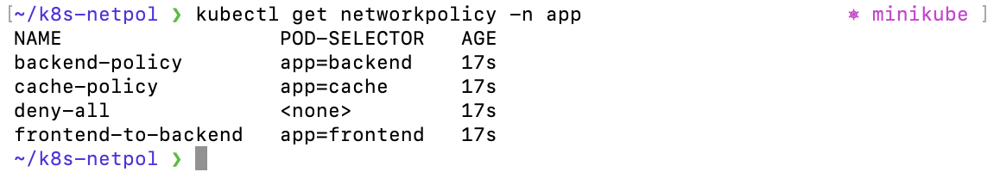
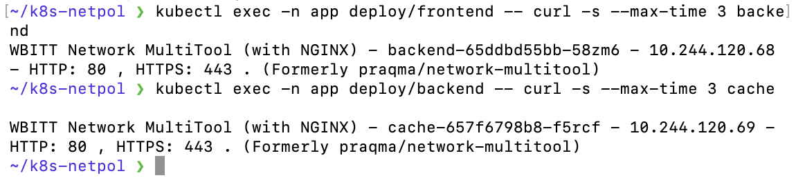
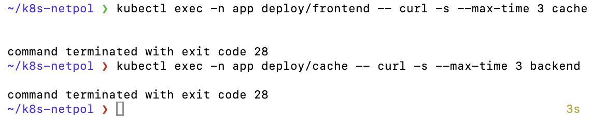

# Домашнее задание к занятию «Как работает сеть в K8s» Савкин ИН

---

## Задание 1. Сетевая политика доступа к подам

### Подготовка кластера

Кластер Minikube запущен с сетевым плагином Calico:

```bash
minikube start --network-plugin=cni --cni=calico --driver=docker
```

Создан namespace `app`:

```bash
kubectl create namespace app
```

### Манифест Deployments (deployments.yaml)

```yaml
apiVersion: apps/v1
kind: Deployment
metadata:
  name: frontend
  namespace: app
spec:
  replicas: 1
  selector:
    matchLabels:
      app: frontend
  template:
    metadata:
      labels:
        app: frontend
    spec:
      containers:
      - name: multitool
        image: wbitt/network-multitool
        ports:
        - containerPort: 80
---
apiVersion: apps/v1
kind: Deployment
metadata:
  name: backend
  namespace: app
spec:
  replicas: 1
  selector:
    matchLabels:
      app: backend
  template:
    metadata:
      labels:
        app: backend
    spec:
      containers:
      - name: multitool
        image: wbitt/network-multitool
        ports:
        - containerPort: 80
---
apiVersion: apps/v1
kind: Deployment
metadata:
  name: cache
  namespace: app
spec:
  replicas: 1
  selector:
    matchLabels:
      app: cache
  template:
    metadata:
      labels:
        app: cache
    spec:
      containers:
      - name: multitool
        image: wbitt/network-multitool
        ports:
        - containerPort: 80
```

### Манифест Services (services.yaml)

```yaml
apiVersion: v1
kind: Service
metadata:
  name: frontend
  namespace: app
spec:
  selector:
    app: frontend
  ports:
  - port: 80
---
apiVersion: v1
kind: Service
metadata:
  name: backend
  namespace: app
spec:
  selector:
    app: backend
  ports:
  - port: 80
---
apiVersion: v1
kind: Service
metadata:
  name: cache
  namespace: app
spec:
  selector:
    app: cache
  ports:
  - port: 80
```

### Манифест NetworkPolicy (networkpolicy.yaml)

```yaml
# Запрещаем весь трафик по умолчанию
apiVersion: networking.k8s.io/v1
kind: NetworkPolicy
metadata:
  name: deny-all
  namespace: app
spec:
  podSelector: {}
  policyTypes:
  - Ingress
  - Egress
---
# Разрешаем DNS для всех подов
apiVersion: networking.k8s.io/v1
kind: NetworkPolicy
metadata:
  name: allow-dns
  namespace: app
spec:
  podSelector: {}
  policyTypes:
  - Egress
  egress:
  - ports:
    - port: 53
      protocol: UDP
    - port: 53
      protocol: TCP
---
# Разрешаем frontend -> backend
apiVersion: networking.k8s.io/v1
kind: NetworkPolicy
metadata:
  name: frontend-to-backend
  namespace: app
spec:
  podSelector:
    matchLabels:
      app: frontend
  policyTypes:
  - Egress
  egress:
  - to:
    - podSelector:
        matchLabels:
          app: backend
    ports:
    - port: 80
---
# Разрешаем backend принимать от frontend и отправлять к cache
apiVersion: networking.k8s.io/v1
kind: NetworkPolicy
metadata:
  name: backend-policy
  namespace: app
spec:
  podSelector:
    matchLabels:
      app: backend
  policyTypes:
  - Ingress
  - Egress
  ingress:
  - from:
    - podSelector:
        matchLabels:
          app: frontend
    ports:
    - port: 80
  egress:
  - to:
    - podSelector:
        matchLabels:
          app: cache
    ports:
    - port: 80
---
# Разрешаем cache принимать от backend
apiVersion: networking.k8s.io/v1
kind: NetworkPolicy
metadata:
  name: cache-policy
  namespace: app
spec:
  podSelector:
    matchLabels:
      app: cache
  policyTypes:
  - Ingress
  ingress:
  - from:
    - podSelector:
        matchLabels:
          app: backend
    ports:
    - port: 80
```

### Результаты проверки

Список NetworkPolicy:



**Разрешённые соединения** (frontend → backend → cache):



**Запрещённые соединения** (frontend → cache, cache → backend):



### Итог

| Соединение | Результат |
|---|---|
| frontend → backend | Разрешено |
| backend → cache | Разрешено |
| frontend → cache | Запрещено (exit code 28) |
| cache → backend | Запрещено (exit code 28) |
